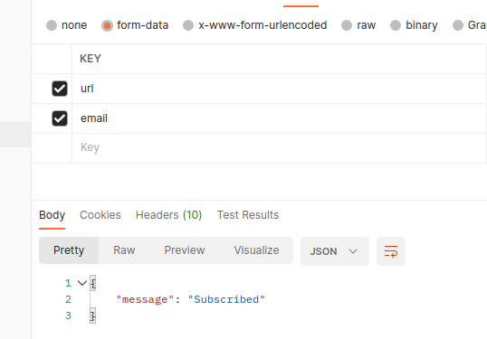
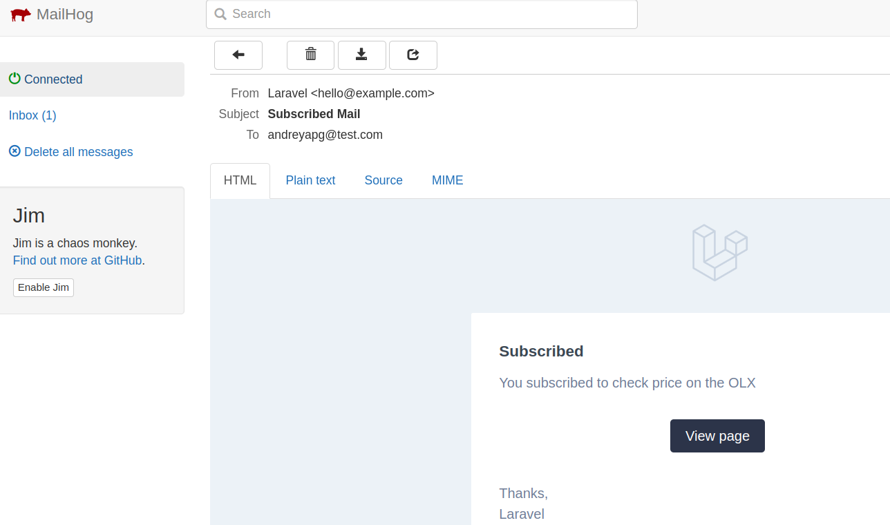
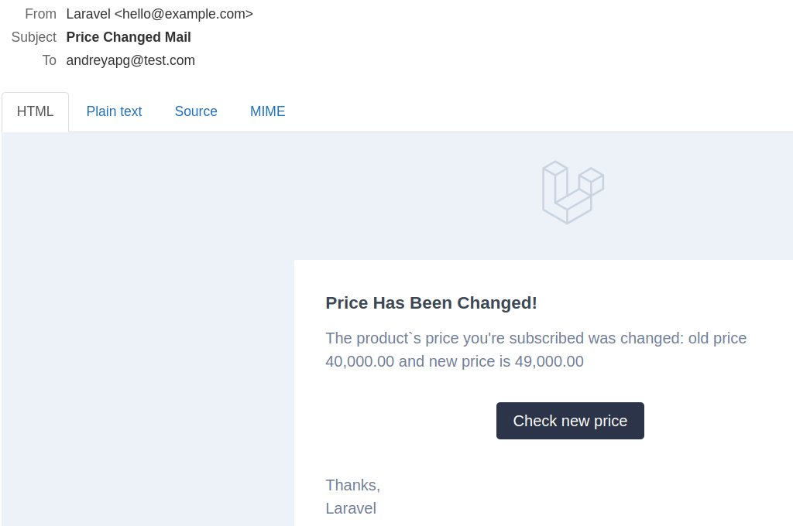

# Test Task

## Table of content

[How to run locally](#how-to-run-locally)

[How to use](#how-to-use)

[Diagram](#diagram)


## How to run locally

- clone project to the local directory
- into the directory run command in the terminal ```make up```
- wait until containers up
- run command into the terminal ```make app-bash```
- into the container run command ```composer install```, wait until the end of installation
- make copy of **.env.example** ```cp .env.example .env```
- set DB password - env variable **DB_PASSWORD**
- after that run command ```php artisan key:generate```
- and command ```php artisan migrate```
- and finally run command ```php artisan schedule:work```


## How to use

Using Postman send request to the **http://localhost:8230/api/v1/subscription**

with next parameters



and visiting **http://localhost:8025** you can see your email



when price is changed you will receive email




## Diagram

Diagram can be checked by PhpStorm IDE

## Test and PINT

When you are into the container (```make app-bash```) you can check code quality ```./vendor/bin/pint app``` and run tests ```php artisan config:clear && php artisan test```